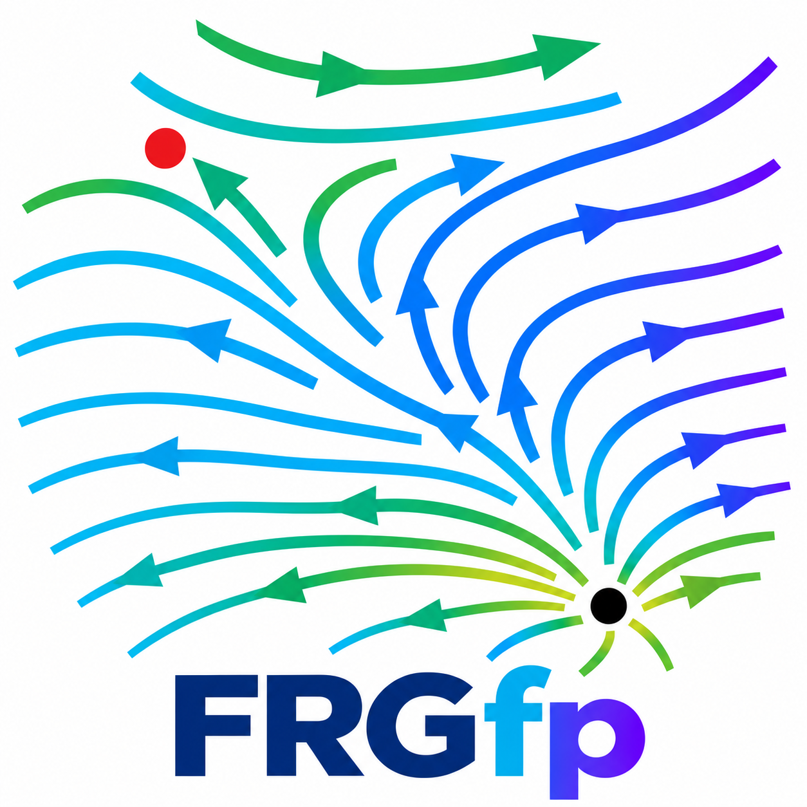

<div style="display: flex; align-items: center; gap: 15px;">
  
  <h1>frgfp</h1>
</div>

Functional Renormalization Group Fixed Point (frgfp) Solver.

A high-performance computational package designed to find global collocation solutions for Functional Renormalization Group (FRG) flow equations. The package provides a robust, generalized framework for evaluating effective potentials and their derivatives on freely specifiable grids.

The core of the package utilizes a highly optimized Eigen C++ backend, heavily leveraging pre-calculated 1D caches and row-major tensor products to perform lightning-fast evaluations of multi-dimensional basis functions, gradients, and Hessian matrices.

## Features

- **Multidimensional basis expansions** – Chebyshev and polynomial ansatz classes with automatic order handling.
- **Collocation grid generators** – uniform and Chebyshev grids for arbitrary invariant dimension.
- **Fast function evaluation** – C++/Eigen backend with zero-allocation loops.
- **Gradient and Hessian evaluation** – analytic derivatives via precomputed caches.
- **LPA solver** – Newton–Gauss fixed-point solver with optional OpenMP multithreading.
- **Numba integration** – user-defined flow equations are JIT-compiled and bridged to C++.

## Installation

### Prerequisites

- Python 3.8 or later
- A C++ compiler (e.g., GCC, Clang, MSVC) with C++14 support
- CMake ≥ 3.12
- Eigen3 (header-only library)

### Install via conda

```bash
conda create -n frgfp python=3.10
conda activate frgfp
conda install -c conda-forge numpy scipy numba eigen cmake
pip install .
```

### Install via pip

```bash
pip install numpy scipy numba
pip install .
```

If you want to install in editable mode (for development):

```bash
pip install -e .
```

### Building from source

The package uses a CMake-based build system. The `pip install .` command will automatically compile the C++ extensions. If you need to build manually:

```bash
mkdir build
cd build
cmake ..
make
```

## Quick Example

```python
import numpy as np
from frgfp import ChebyshevAnsatz, uniform_collgrid, FuncFromAnsatz

# Define a 1D Chebyshev ansatz of order 5 on interval [-1, 1]
ansatz = ChebyshevAnsatz(inv_dim=1, order=5, interval=(-1.0, 1.0))

# Generate a uniform collocation grid with 20 points
grid = uniform_collgrid(inv_dim=1, num_points=20, interval=(-1.0, 1.0))

# Create a function from a known coefficient vector
coeffs = np.random.rand(ansatz.num_coeffs)
func = FuncFromAnsatz(ansatz=ansatz, coeffs=coeffs)

# Evaluate on the grid
vals = func.evaluate(grid)
print(vals)
```

## Documentation

For detailed API documentation, see the docstrings in the source code or run:

```bash
python -c "import frgfp; help(frgfp)"
```

## License

This project is licensed under the MIT License – see the LICENSE file for details.
